# Design Document: TechMentor AI

## 1. System Overview

TechMentor AI is an AWS-native serverless learning platform that converts predefined roadmaps into portfolio-ready projects through AI-guided execution. The system targets Tier 2/Tier 3 students and self-learners in India, providing structured learning paths with XP-based progression and context-aware AI mentorship.

### Architecture Philosophy

The platform follows a **100% serverless architecture** to achieve:
- Zero infrastructure management
- Automatic scaling based on demand
- Pay-per-use cost model staying under $100 AWS credits
- High availability without manual intervention
- Rapid deployment for hackathon demonstration

### High-Level System Flow

```
User (Browser)
     ↓
AWS Amplify (Frontend Hosting)
     ↓
API Gateway (REST APIs)
     ↓
AWS Lambda (Business Logic)
     ↓
┌────────────┬──────────────┬─────────────┐
│  DynamoDB  │   Bedrock    │    Polly    │
│  (Storage) │  (AI Mentor) │    (TTS)    │
└────────────┴──────────────┴─────────────┘
     ↓
CloudWatch (Logging & Monitoring)
```

---

## 2. High-Level AWS Architecture Diagram

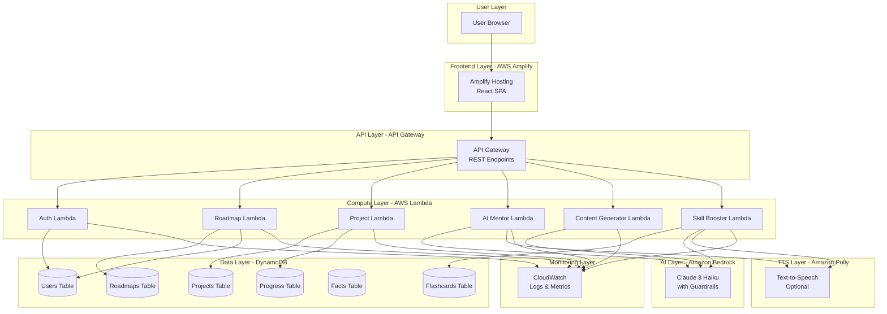


---

## 3. Detailed Component Architecture

### Frontend Layer

**Purpose**: Provide responsive web interface for user interactions

**AWS Service**: AWS Amplify
- Static hosting for React single-page application
- Automatic HTTPS with SSL certificates
- CDN distribution for fast global access
- CI/CD integration for rapid deployment

**Why Chosen**:
- Zero server management
- Free tier: 1000 build minutes, 15GB storage
- Built-in CDN for performance
- Perfect for hackathon rapid deployment

**Scalability Benefit**:
- Automatically scales to handle traffic spikes
- Global CDN ensures low latency worldwide
- No capacity planning required

---

### API Layer

**Purpose**: Expose RESTful endpoints for frontend-backend communication

**AWS Service**: API Gateway
- REST API endpoints for all operations
- Request validation and transformation
- Rate limiting and throttling
- CORS configuration

**Why Chosen**:
- Serverless API management
- Free tier: 1M requests/month
- Built-in security features
- Seamless Lambda integration

**Scalability Benefit**:
- Handles millions of requests automatically
- Built-in DDoS protection
- No infrastructure to manage

---

### Compute Layer

**Purpose**: Execute all business logic serverlessly

**AWS Service**: AWS Lambda (6 functions)

1. **Auth Lambda**: Username validation and session management
2. **Roadmap Lambda**: Load and assign predefined roadmaps
3. **Project Lambda**: Manage projects, tasks, and XP tracking
4. **AI Mentor Lambda**: Handle AI interactions with Bedrock
5. **Content Generator Lambda**: Generate README and LinkedIn posts
6. **Skill Booster Lambda**: Manage quizzes and flashcards

**Why Chosen**:
- Pay only for execution time
- Free tier: 1M requests, 400K GB-seconds
- Auto-scaling without configuration
- Perfect for event-driven architecture

**Scalability Benefit**:
- Scales from 0 to thousands of concurrent executions
- No cold start issues with proper optimization
- Cost-effective for variable workloads

---

### Database Layer

**Purpose**: Store all application data with high performance

**AWS Service**: DynamoDB (6 tables)

**Why Chosen**:
- Serverless NoSQL database
- Free tier: 25GB storage, 25 RCU/WCU
- Single-digit millisecond latency
- Perfect for key-value and document storage

**Scalability Benefit**:
- Automatic scaling based on traffic
- No capacity planning required
- Handles millions of requests per second

---

### AI Layer

**Purpose**: Provide context-aware AI mentorship and content generation

**AWS Service**: Amazon Bedrock with Claude 3 Haiku

**Why Chosen**:
- Most cost-effective model (~$0.25/1M input tokens)
- Sufficient capability for hints and explanations
- Built-in guardrails to prevent full code solutions
- Native AWS integration

**Scalability Benefit**:
- Fully managed service
- No model hosting or infrastructure
- Automatic scaling for concurrent requests

---

### TTS Layer

**Purpose**: Optional text-to-speech for accessibility

**AWS Service**: Amazon Polly

**Why Chosen**:
- Natural-sounding voices
- Pay-per-character pricing
- Low latency for real-time conversion
- Multiple language support for future expansion

**Scalability Benefit**:
- Fully managed service
- Handles unlimited concurrent requests
- Optional feature to control costs

---

### Logging Layer

**Purpose**: Monitor application health and debug issues

**AWS Service**: CloudWatch

**Why Chosen**:
- Native integration with all AWS services
- Free tier: 5GB logs, 10 metrics
- Real-time monitoring and alerting
- Essential for production debugging

**Scalability Benefit**:
- Automatically collects logs from all services
- No log storage management required
- Scales with application growth


---

## 4. Data Flow Diagrams

### A. Questionnaire → AI Path Assignment Flow

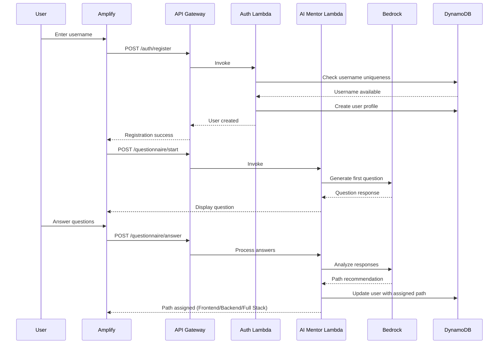

---

### B. Mentor Guidance Flow

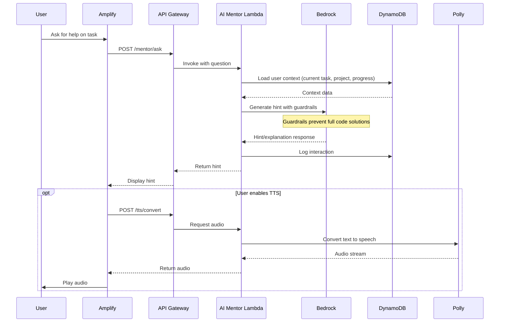

---

### C. README Generator Flow

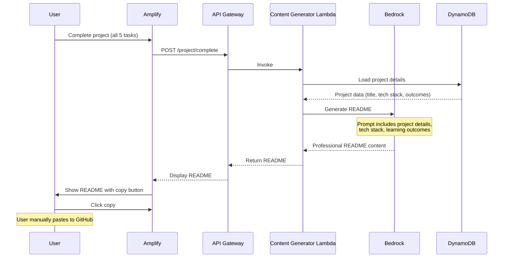

---

### D. LinkedIn Generator Flow

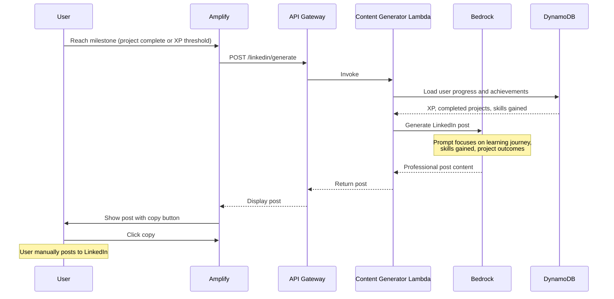

---

### E. Skill Booster + Flashcards Flow

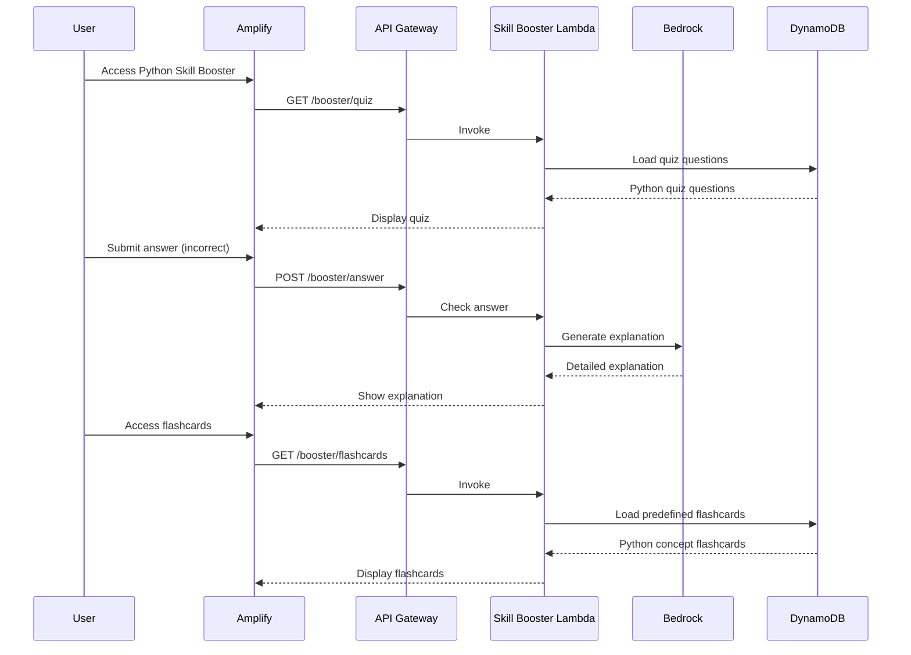

---

### F. Facts Engine Flow

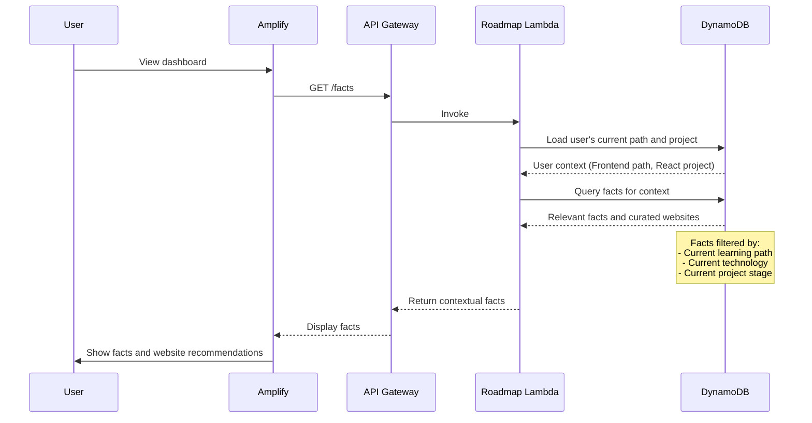


---

## 5. DynamoDB Schema Design

### Why NoSQL (DynamoDB)?

NoSQL is ideal for TechMentor AI because:
1. **Flexible Schema**: Roadmaps and projects have varying structures
2. **High Performance**: Single-digit millisecond latency for user interactions
3. **Serverless**: No database servers to manage
4. **Cost-Effective**: Free tier covers MVP needs
5. **Scalability**: Automatic scaling without capacity planning

---

### Table 1: Users

**Purpose**: Store user profiles, authentication, and progress

**Primary Key**: `username` (Partition Key)

**Attributes**:
```json
{
  "username": "string",
  "createdAt": "timestamp",
  "assignedPath": "Frontend | Backend | Full Stack",
  "currentRoadmapId": "string",
  "currentProjectId": "string",
  "totalXP": "number",
  "completedProjects": ["projectId1", "projectId2"],
  "completedTasks": ["taskId1", "taskId2"],
  "preferences": {
    "ttsEnabled": "boolean"
  }
}
```

**Example Item**:
```json
{
  "username": "rahul_dev",
  "createdAt": "2026-02-28T10:00:00Z",
  "assignedPath": "Full Stack",
  "currentRoadmapId": "roadmap_fullstack",
  "currentProjectId": "project_todo_app",
  "totalXP": 45,
  "completedProjects": ["project_portfolio"],
  "completedTasks": ["task_1", "task_2", "task_3"],
  "preferences": {
    "ttsEnabled": false
  }
}
```

**Query Patterns**:
- Get user by username: `GetItem(username)`
- Update XP: `UpdateItem(username, totalXP)`

---

### Table 2: Roadmaps

**Purpose**: Store 3 predefined learning paths

**Primary Key**: `roadmapId` (Partition Key)

**Attributes**:
```json
{
  "roadmapId": "string",
  "pathName": "Frontend | Backend | Full Stack",
  "description": "string",
  "stages": [
    {
      "stageId": "string",
      "stageName": "string",
      "technologies": ["tech1", "tech2"]
    }
  ],
  "projects": ["projectId1", "projectId2", "projectId3"]
}
```

**Example Item**:
```json
{
  "roadmapId": "roadmap_frontend",
  "pathName": "Frontend",
  "description": "Master modern frontend development",
  "stages": [
    {
      "stageId": "stage_1",
      "stageName": "HTML/CSS Fundamentals",
      "technologies": ["HTML5", "CSS3", "Flexbox", "Grid"]
    },
    {
      "stageId": "stage_2",
      "stageName": "JavaScript Essentials",
      "technologies": ["ES6+", "DOM", "Async/Await"]
    },
    {
      "stageId": "stage_3",
      "stageName": "React Framework",
      "technologies": ["React", "Hooks", "Context API"]
    }
  ],
  "projects": ["project_portfolio", "project_todo_app", "project_ecommerce"]
}
```

**Query Patterns**:
- Get roadmap by ID: `GetItem(roadmapId)`
- Get roadmap by path: `Query(pathName-index)`

---

### Table 3: Projects

**Purpose**: Store 9 predefined projects (3 per roadmap)

**Primary Key**: `projectId` (Partition Key)

**Global Secondary Index**: `roadmapId-difficulty-index` for querying projects by roadmap and difficulty

**Attributes**:
```json
{
  "projectId": "string",
  "roadmapId": "string",
  "title": "string",
  "description": "string",
  "difficulty": "Beginner | Intermediate | Advanced",
  "techStack": ["tech1", "tech2"],
  "expectedOutcome": "string",
  "tasks": [
    {
      "taskId": "string",
      "title": "string",
      "description": "string",
      "estimatedMinutes": "number",
      "xpReward": 5
    }
  ],
  "totalXP": 25
}
```

**Example Item**:
```json
{
  "projectId": "project_todo_app",
  "roadmapId": "roadmap_frontend",
  "title": "Interactive Todo Application",
  "description": "Build a full-featured todo app with React",
  "difficulty": "Intermediate",
  "techStack": ["React", "Hooks", "LocalStorage", "CSS"],
  "expectedOutcome": "Fully functional todo app with add, edit, delete, and filter features",
  "tasks": [
    {
      "taskId": "task_1",
      "title": "Set up React project and component structure",
      "description": "Initialize React app and create base components",
      "estimatedMinutes": 60,
      "xpReward": 5
    },
    {
      "taskId": "task_2",
      "title": "Implement add and display functionality",
      "description": "Create form to add todos and display them in a list",
      "estimatedMinutes": 90,
      "xpReward": 5
    },
    {
      "taskId": "task_3",
      "title": "Add edit and delete features",
      "description": "Enable users to edit and delete existing todos",
      "estimatedMinutes": 90,
      "xpReward": 5
    },
    {
      "taskId": "task_4",
      "title": "Implement filtering and sorting",
      "description": "Add filters for completed/active todos and sorting options",
      "estimatedMinutes": 75,
      "xpReward": 5
    },
    {
      "taskId": "task_5",
      "title": "Add LocalStorage persistence",
      "description": "Save todos to LocalStorage for data persistence",
      "estimatedMinutes": 45,
      "xpReward": 5
    }
  ],
  "totalXP": 25
}
```

**Query Patterns**:
- Get project by ID: `GetItem(projectId)`
- Get projects by roadmap: `Query(roadmapId-difficulty-index)`

---

### Table 4: Progress

**Purpose**: Track user progress on tasks and projects

**Primary Key**: `username` (Partition Key), `itemId` (Sort Key)

**Attributes**:
```json
{
  "username": "string",
  "itemId": "string",
  "itemType": "task | project",
  "completedAt": "timestamp",
  "xpEarned": "number"
}
```

**Example Item**:
```json
{
  "username": "rahul_dev",
  "itemId": "task_1",
  "itemType": "task",
  "completedAt": "2026-02-28T14:30:00Z",
  "xpEarned": 5
}
```

**Query Patterns**:
- Get user progress: `Query(username)`
- Check task completion: `GetItem(username, itemId)`

---

### Table 5: Facts

**Purpose**: Store curated educational facts and website recommendations

**Primary Key**: `factId` (Partition Key)

**Global Secondary Index**: `category-index` for querying facts by technology or path

**Attributes**:
```json
{
  "factId": "string",
  "category": "string",
  "title": "string",
  "content": "string",
  "relatedWebsites": [
    {
      "name": "string",
      "url": "string",
      "description": "string"
    }
  ]
}
```

**Example Item**:
```json
{
  "factId": "fact_react_hooks",
  "category": "React",
  "title": "React Hooks Revolution",
  "content": "React Hooks were introduced in React 16.8 to allow functional components to use state and lifecycle features without writing classes.",
  "relatedWebsites": [
    {
      "name": "React Official Docs",
      "url": "https://react.dev/reference/react",
      "description": "Official React documentation with comprehensive Hooks guide"
    },
    {
      "name": "Hooks FAQ",
      "url": "https://react.dev/learn/hooks-faq",
      "description": "Common questions about React Hooks answered"
    }
  ]
}
```

**Query Patterns**:
- Get facts by category: `Query(category-index)`
- Get random fact: `Scan(limit=1, random)`

---

### Table 6: Flashcards

**Purpose**: Store predefined Python flashcards for Skill Booster

**Primary Key**: `flashcardId` (Partition Key)

**Attributes**:
```json
{
  "flashcardId": "string",
  "concept": "string",
  "question": "string",
  "answer": "string",
  "difficulty": "Beginner | Intermediate | Advanced",
  "codeExample": "string"
}
```

**Example Item**:
```json
{
  "flashcardId": "flashcard_list_comprehension",
  "concept": "List Comprehension",
  "question": "What is list comprehension and when should you use it?",
  "answer": "List comprehension is a concise way to create lists in Python. Use it when you need to transform or filter an iterable into a new list in a single line.",
  "difficulty": "Intermediate",
  "codeExample": "squares = [x**2 for x in range(10)]"
}
```

**Query Patterns**:
- Get all flashcards: `Scan()`
- Get flashcards by difficulty: `Query(difficulty-index)`

---

### Table Relationship Diagram

```mermaid
erDiagram
    USERS ||--o{ PROGRESS : tracks
    USERS }o--|| ROADMAPS : assigned
    ROADMAPS ||--o{ PROJECTS : contains
    PROJECTS ||--o{ PROGRESS : generates
    FACTS }o--o{ ROADMAPS : contextual
    FLASHCARDS }o--|| USERS : studies
    
    USERS {
        string username PK
        string assignedPath
        string currentRoadmapId FK
        string currentProjectId FK
        number totalXP
    }
    
    ROADMAPS {
        string roadmapId PK
        string pathName
        array stages
        array projects
    }
    
    PROJECTS {
        string projectId PK
        string roadmapId FK
        string difficulty
        array tasks
        number totalXP
    }
    
    PROGRESS {
        string username PK
        string itemId SK
        string itemType
        timestamp completedAt
    }
    
    FACTS {
        string factId PK
        string category
        array relatedWebsites
    }
    
    FLASHCARDS {
        string flashcardId PK
        string concept
        string difficulty
    }
```


---

## 6. AI Integration Design

### Why AI is Required

1. **Personalized Path Assignment**: Static questionnaires can't adapt to nuanced responses; AI understands context and assigns optimal learning paths
2. **Context-Aware Mentorship**: AI maintains conversation history and project context to provide relevant, timely guidance
3. **Adaptive Explanations**: AI tailors explanations to user's skill level and learning style
4. **Content Generation**: AI creates professional README and LinkedIn content specific to each user's journey
5. **Scalability**: AI mentor supports unlimited concurrent users without human mentors

### Why Claude 3 Haiku?

| Factor | Claude 3 Haiku | Alternative (GPT-4) | Alternative (Sonnet) |
|--------|----------------|---------------------|----------------------|
| Cost | ~$0.25/1M tokens | ~$30/1M tokens | ~$3/1M tokens |
| Speed | Fast (< 1s) | Slower (2-3s) | Medium (1-2s) |
| Capability | Sufficient for hints | Overkill for MVP | More than needed |
| Guardrails | Native Bedrock | Custom implementation | Native Bedrock |
| AWS Integration | Seamless | API calls | Seamless |

**Decision**: Haiku provides the best cost-performance ratio for MVP, staying well under $100 budget.

### Prompt Structure

All AI interactions follow a structured prompt format:

```
System Prompt:
You are TechMentor AI, an educational assistant for project-based learning.
Your role is to guide learners through hints and explanations, NEVER provide complete code solutions.
Use Socratic questioning to help users discover solutions themselves.

Context:
- User: {username}
- Learning Path: {Frontend/Backend/Full Stack}
- Current Project: {project_title}
- Current Task: {task_description}
- User Progress: {completed_tasks_count}/5 tasks

Guardrails:
- NEVER provide complete code solutions
- NEVER write full functions or classes
- ALWAYS provide hints, not answers
- ALWAYS ask guiding questions
- ALWAYS explain concepts, not implementations

User Question:
{user_question}

Response:
```

### Guardrails Implementation

Amazon Bedrock Guardrails prevent inappropriate responses:

1. **Content Filters**:
   - Block complete code solutions (> 10 lines of code)
   - Block copy-paste answers
   - Block direct function implementations

2. **Topic Filters**:
   - Allow: Concepts, hints, explanations, questions
   - Block: Complete solutions, full implementations

3. **Response Validation**:
   - Check response for code blocks > 10 lines
   - Check for function/class definitions
   - Reject and regenerate if violations detected

### Bedrock Invocation Flow

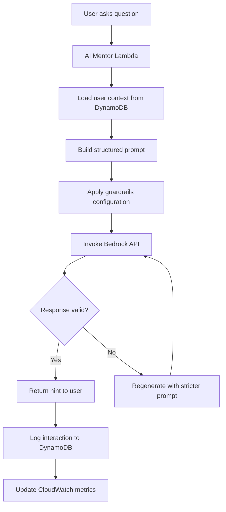

### Where AI is Intentionally NOT Used

1. **XP Calculation**: Simple arithmetic (+5 per task, +25 per project) - no AI needed
2. **Task Completion Tracking**: Boolean state management - no AI needed
3. **Roadmap Loading**: Predefined data retrieval from DynamoDB - no AI needed
4. **User Authentication**: Username validation - no AI needed
5. **Flashcard Display**: Static content retrieval - no AI needed

**Rationale**: Using AI for simple operations wastes tokens and increases costs unnecessarily.


---

## 7. XP Engine Architecture

### XP Calculation Logic

The XP system uses fixed rewards for simplicity and predictability:

```
Task Completion: +5 XP
Project Completion: +25 XP (5 tasks × 5 XP)
Total XP per Project: 25 XP
Total XP per Roadmap: 75 XP (3 projects × 25 XP)
Total XP for All Paths: 225 XP (3 roadmaps × 75 XP)
```

### State Progression Diagram

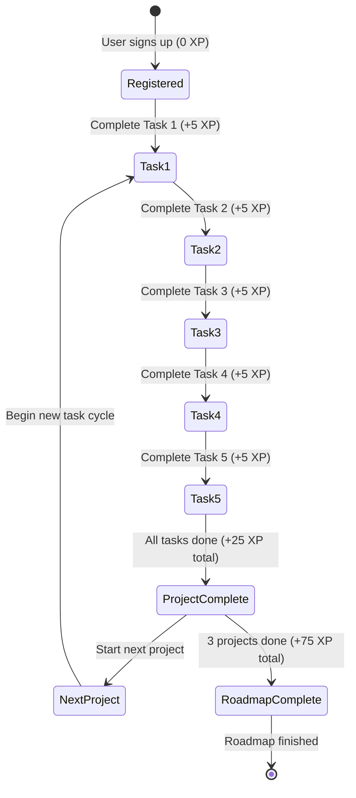

### XP Update Flow

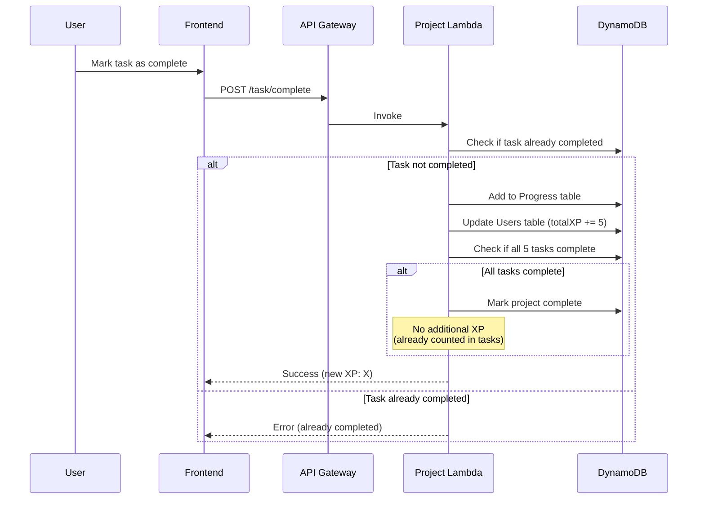

### XP Display Logic

```javascript
// Frontend XP display calculation
function calculateXPBreakdown(user) {
  return {
    totalXP: user.totalXP,
    tasksCompleted: user.completedTasks.length,
    projectsCompleted: user.completedProjects.length,
    currentProjectProgress: {
      tasksCompleted: getCurrentProjectTasks(user),
      tasksRemaining: 5 - getCurrentProjectTasks(user),
      xpEarned: getCurrentProjectTasks(user) * 5,
      xpRemaining: (5 - getCurrentProjectTasks(user)) * 5
    },
    roadmapProgress: {
      projectsCompleted: user.completedProjects.length % 3,
      projectsRemaining: 3 - (user.completedProjects.length % 3),
      xpEarned: (user.completedProjects.length % 3) * 25,
      xpRemaining: (3 - (user.completedProjects.length % 3)) * 25
    }
  };
}
```


---

## 8. Text-to-Speech Architecture

### How Lambda Invokes Amazon Polly

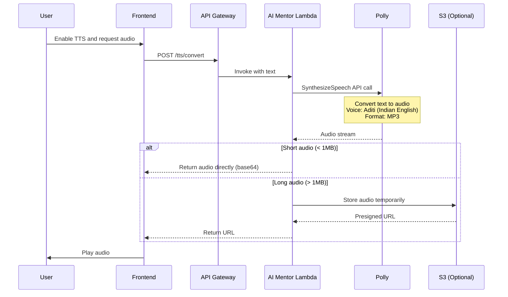

### TTS Flow Diagram

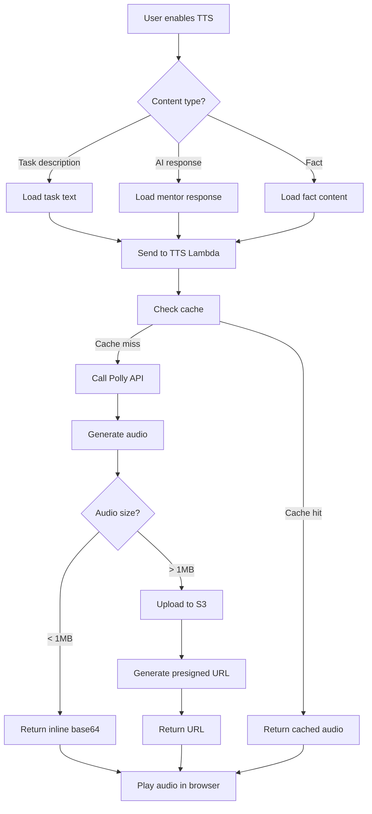

### Polly Configuration

```javascript
// Lambda code for Polly invocation
const AWS = require('aws-sdk');
const polly = new AWS.Polly();

async function convertTextToSpeech(text) {
  const params = {
    Text: text,
    OutputFormat: 'mp3',
    VoiceId: 'Aditi', // Indian English female voice
    Engine: 'neural', // Higher quality
    LanguageCode: 'en-IN'
  };
  
  try {
    const result = await polly.synthesizeSpeech(params).promise();
    return result.AudioStream;
  } catch (error) {
    console.error('Polly error:', error);
    throw error;
  }
}
```

### Cost Optimization for TTS

1. **Optional Feature**: Disabled by default, user must explicitly enable
2. **Caching**: Cache frequently requested audio (task descriptions, common facts)
3. **Character Limits**: Limit TTS to 3000 characters per request
4. **Voice Selection**: Use standard voices for lower cost (neural only for premium)
5. **Compression**: Use MP3 format for smaller file sizes

**Estimated Cost**:
- Standard voice: $4 per 1M characters
- Neural voice: $16 per 1M characters
- MVP estimate: ~500K characters = $2-8 depending on voice choice


---

## 9. Security Architecture

### IAM Roles and Permissions

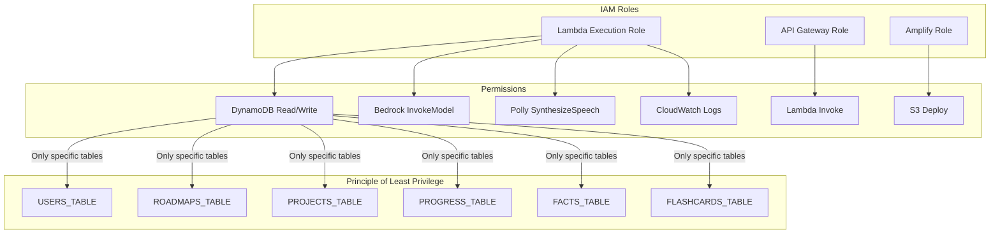

### Security Layers

#### 1. No Direct Database Exposure
- DynamoDB tables are NOT publicly accessible
- All access goes through Lambda functions
- Lambda functions have specific IAM roles with minimal permissions
- No database credentials stored in code

#### 2. Serverless Isolation
- Each Lambda function runs in isolated execution environment
- Functions cannot access each other's memory or state
- API Gateway provides request/response isolation
- No shared infrastructure between users

#### 3. HTTPS via Amplify
- All traffic encrypted with TLS 1.2+
- Amplify provides automatic SSL certificates
- No HTTP traffic allowed
- CDN (CloudFront) provides DDoS protection

#### 4. Guardrails Enforcement
- Bedrock guardrails prevent inappropriate AI responses
- Content filtering blocks malicious prompts
- Rate limiting prevents abuse
- Response validation ensures safe outputs

#### 5. Input Validation
- API Gateway validates request schemas
- Lambda functions sanitize user inputs
- DynamoDB validates data types
- No SQL injection risk (NoSQL database)

### Security Best Practices

```javascript
// Example: Input validation in Lambda
function validateUsername(username) {
  // Only alphanumeric and underscore, 3-20 characters
  const regex = /^[a-zA-Z0-9_]{3,20}$/;
  if (!regex.test(username)) {
    throw new Error('Invalid username format');
  }
  return username.toLowerCase();
}

// Example: Sanitize user input before AI
function sanitizePrompt(userInput) {
  // Remove potential prompt injection attempts
  const sanitized = userInput
    .replace(/system:/gi, '')
    .replace(/assistant:/gi, '')
    .replace(/<\|.*?\|>/g, '')
    .trim();
  
  // Limit length to prevent token abuse
  return sanitized.substring(0, 1000);
}
```

### Authentication Flow

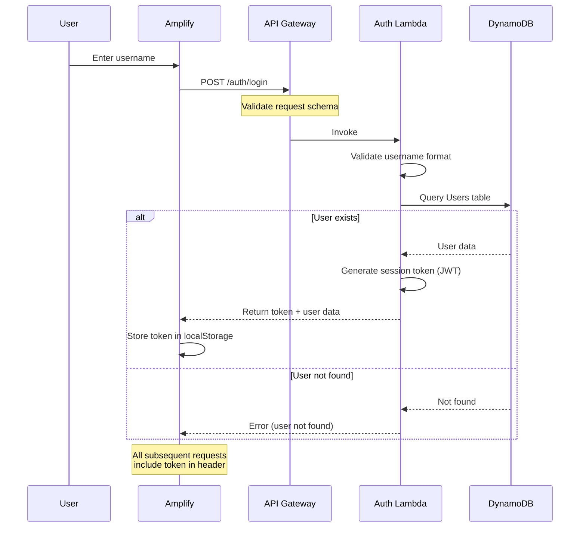

### Data Privacy

1. **No PII Collection**: Only username required (no email, phone, address)
2. **No Third-Party Sharing**: All data stays within AWS
3. **User Control**: Users can request data deletion
4. **Audit Logs**: CloudWatch logs all data access for compliance
5. **Encryption at Rest**: DynamoDB encrypts all data automatically


---

## 10. Cost Optimization Strategy

### Why Serverless?

| Traditional Architecture | Serverless Architecture |
|-------------------------|-------------------------|
| Pay for 24/7 server uptime | Pay only for execution time |
| Manual scaling required | Automatic scaling |
| Minimum $50-100/month | Can be $0 with free tier |
| Infrastructure management | Zero management |
| Fixed capacity | Unlimited capacity |

**Result**: Serverless reduces MVP costs from $500+ to under $100.

### Why Predefined Roadmaps?

| Dynamic Generation | Predefined Roadmaps |
|-------------------|---------------------|
| AI generates roadmaps on-demand | Roadmaps stored in DynamoDB |
| ~10K tokens per roadmap | 0 tokens (just retrieval) |
| $2.50 per roadmap generation | $0 per roadmap load |
| Inconsistent quality | Curated, high-quality content |
| Slow (5-10 seconds) | Fast (< 100ms) |

**Result**: Predefined roadmaps save ~$50 in AI costs and improve UX.

### Why Haiku Over Sonnet?

| Claude 3 Haiku | Claude 3 Sonnet |
|----------------|-----------------|
| $0.25 / 1M input tokens | $3 / 1M input tokens |
| $1.25 / 1M output tokens | $15 / 1M output tokens |
| Fast (< 1s response) | Slower (1-2s response) |
| Sufficient for hints | Overkill for MVP |

**Example Calculation** (200K AI interactions):
- Haiku: ~$30-40
- Sonnet: ~$360-480

**Result**: Haiku saves $320+ while meeting all MVP requirements.

### Expected AWS Credit Usage

| Service | Free Tier | Expected Usage | Estimated Cost |
|---------|-----------|----------------|----------------|
| **Amplify** | 1000 build min, 15GB storage | 10 builds, 500MB | $0 |
| **API Gateway** | 1M requests/month | 100K requests | $0 |
| **Lambda** | 1M requests, 400K GB-sec | 100K invocations | $0 |
| **DynamoDB** | 25GB, 25 RCU/WCU | 10GB, 10 RCU/WCU | $0 |
| **Bedrock (Haiku)** | None | 200K interactions | $30-40 |
| **Polly (Optional)** | 5M characters/month | 500K characters | $2-8 |
| **CloudWatch** | 5GB logs, 10 metrics | 2GB logs | $0 |
| **S3 (if needed)** | 5GB storage, 20K requests | 1GB, 5K requests | $0 |
| **Total** | | | **$32-48** |

**Buffer for Testing**: $20-30
**Total with Buffer**: **$52-78**

**Result**: Well under $100 budget with room for testing and demos.

### Cost Optimization Techniques

1. **Leverage Free Tiers**:
   - Use free tier services to maximum capacity
   - Stay within limits during MVP phase
   - Monitor usage with CloudWatch alarms

2. **Minimize AI Token Usage**:
   - Use predefined content where possible
   - Limit prompt lengths to 1000 characters
   - Cache common AI responses
   - Use Haiku instead of Sonnet/Opus

3. **Efficient DynamoDB Queries**:
   - Use GetItem instead of Scan when possible
   - Create GSIs for common query patterns
   - Batch operations where applicable
   - Use on-demand pricing (no provisioned capacity)

4. **Optional Features**:
   - Make Polly TTS optional (disabled by default)
   - Implement feature flags for expensive operations
   - Allow users to control AI interaction frequency

5. **Caching Strategy**:
   - Cache roadmaps in Lambda memory (reuse)
   - Cache project data to reduce DynamoDB reads
   - Cache common AI responses (FAQs)
   - Use CloudFront CDN for static assets

### Monitoring and Alerts

```javascript
// CloudWatch alarm for cost monitoring
{
  "AlarmName": "HighBedrockCost",
  "MetricName": "InvokeModelCount",
  "Namespace": "AWS/Bedrock",
  "Threshold": 150000, // Alert at 150K invocations
  "ComparisonOperator": "GreaterThanThreshold",
  "EvaluationPeriods": 1,
  "Period": 86400 // Daily check
}
```


---

## 11. Scalability & Future Scope

### How the System Scales

#### Current MVP Capacity
- **Users**: 100-500 concurrent users
- **Roadmaps**: 3 predefined paths
- **Projects**: 9 total (3 per roadmap)
- **AI Interactions**: 200K per month
- **Cost**: $50-80/month

#### Phase 1: More Roadmaps (Month 2-3)
- **Add**: 5 more roadmaps (Mobile, DevOps, Data Science, Cloud, Cybersecurity)
- **Total Roadmaps**: 8
- **Total Projects**: 24 (3 per roadmap)
- **Users**: 1,000 concurrent
- **Cost**: $200-300/month
- **Changes Required**: Add DynamoDB items (no architecture changes)

#### Phase 2: More Projects per Roadmap (Month 4-6)
- **Add**: 2 more projects per roadmap (5 total per roadmap)
- **Total Projects**: 40
- **Users**: 5,000 concurrent
- **Cost**: $500-800/month
- **Changes Required**: None (serverless auto-scales)

#### Phase 3: Advanced Features (Month 7-12)
- **Add**: 
  - Code review AI (analyze user code submissions)
  - Peer collaboration (share projects with other learners)
  - Video tutorials integration
  - Certificate generation
- **Users**: 10,000+ concurrent
- **Cost**: $1,500-2,500/month
- **Changes Required**: New Lambda functions, S3 for code storage

#### Phase 4: RAG Integration (Year 2)
- **Add**: Retrieval-Augmented Generation for personalized content
- **Features**:
  - AI generates custom projects based on user interests
  - Dynamic roadmap creation
  - Personalized learning paths beyond 3 predefined options
- **Users**: 50,000+ concurrent
- **Cost**: $5,000-10,000/month
- **Changes Required**: 
  - Vector database (OpenSearch or Pinecone)
  - Embedding generation pipeline
  - Enhanced AI prompts with RAG context

### Scalability Advantages of Serverless

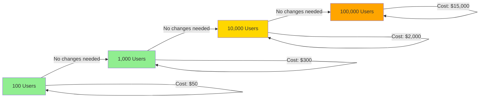

**Key Point**: Serverless architecture scales automatically without code changes or infrastructure management.

### Future Enhancements

#### 1. Multi-Language Support
- **Current**: Python Skill Booster only
- **Future**: JavaScript, Java, Go, Rust skill boosters
- **Implementation**: Add new flashcard sets and quiz questions to DynamoDB
- **Cost Impact**: Minimal (just storage)

#### 2. Regional Language Support
- **Current**: English only
- **Future**: Hindi, Tamil, Telugu, Bengali (AI for Bharat)
- **Implementation**: 
  - Use Polly's Indian language voices
  - Translate UI with i18n
  - Use multilingual Bedrock models
- **Cost Impact**: +$100-200/month for additional AI usage

#### 3. Mobile App
- **Current**: Web only
- **Future**: React Native mobile app
- **Implementation**: Reuse same API Gateway endpoints
- **Cost Impact**: $0 (same backend)

#### 4. Gamification
- **Current**: Simple XP system
- **Future**: 
  - Badges and achievements
  - Leaderboards
  - Streak tracking
  - Daily challenges
- **Implementation**: Add new DynamoDB tables for achievements
- **Cost Impact**: Minimal

#### 5. Job Placement Integration
- **Current**: LinkedIn post generator
- **Future**: 
  - Direct job board integration
  - Resume builder
  - Interview prep AI
  - Company matching
- **Implementation**: New Lambda functions, external API integrations
- **Cost Impact**: +$500-1000/month

#### 6. Community Features
- **Current**: Solo learning
- **Future**:
  - Discussion forums
  - Code review from peers
  - Project collaboration
  - Mentorship matching
- **Implementation**: WebSocket API (API Gateway), real-time features
- **Cost Impact**: +$300-500/month

### Migration Path to RAG

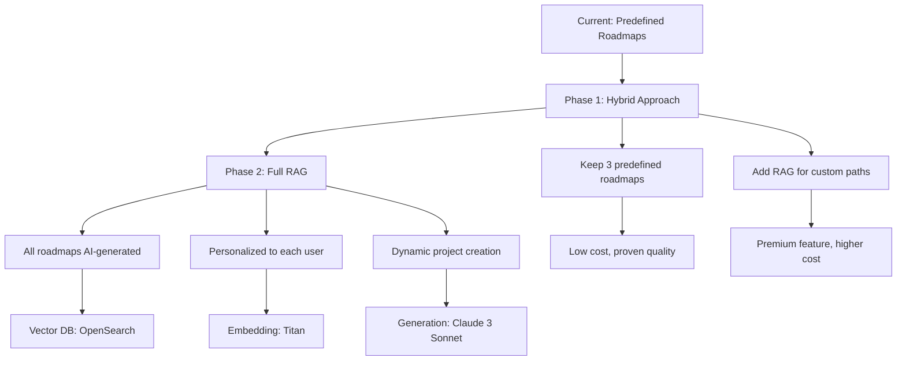

**RAG Benefits**:
- Unlimited roadmap possibilities
- Personalized to each user's unique background
- Always up-to-date with latest technologies
- Can incorporate user's existing projects

**RAG Challenges**:
- Higher cost (~$5-10 per custom roadmap)
- Requires vector database ($100-500/month)
- More complex architecture
- Quality control harder than predefined content

**Recommendation**: Start with predefined roadmaps for MVP, add RAG as premium feature in Year 2.


---

## 12. Implementation Roadmap

### 5-Day MVP Development Plan

#### Day 1: Infrastructure Setup
- [ ] Set up AWS account and configure IAM roles
- [ ] Create DynamoDB tables (Users, Roadmaps, Projects, Progress, Facts, Flashcards)
- [ ] Set up API Gateway with basic endpoints
- [ ] Create Lambda function stubs (6 functions)
- [ ] Configure Bedrock access and test Haiku model
- [ ] Set up CloudWatch logging

#### Day 2: Core Backend Logic
- [ ] Implement Auth Lambda (username validation, session management)
- [ ] Implement Roadmap Lambda (load predefined roadmaps)
- [ ] Implement Project Lambda (task management, XP tracking)
- [ ] Seed DynamoDB with 3 roadmaps and 9 projects
- [ ] Test API endpoints with Postman

#### Day 3: AI Integration
- [ ] Implement AI Mentor Lambda with Bedrock integration
- [ ] Configure guardrails for safe responses
- [ ] Implement Content Generator Lambda (README, LinkedIn)
- [ ] Implement Skill Booster Lambda (quizzes, flashcards)
- [ ] Test AI responses for quality and safety

#### Day 4: Frontend Development
- [ ] Create React app with Amplify
- [ ] Build authentication UI (username login)
- [ ] Build dashboard (roadmap view, project list, XP display)
- [ ] Build project view (5 tasks, completion tracking)
- [ ] Build AI mentor chat interface
- [ ] Build content generator UI (README, LinkedIn)
- [ ] Build Skill Booster UI (quiz, flashcards)

#### Day 5: Integration, Testing, and Demo Prep
- [ ] Connect frontend to backend APIs
- [ ] End-to-end testing of all user flows
- [ ] Implement optional Polly TTS
- [ ] Add Facts Engine to dashboard
- [ ] Performance optimization
- [ ] Deploy to Amplify
- [ ] Prepare demo script and presentation

### Critical Path Items

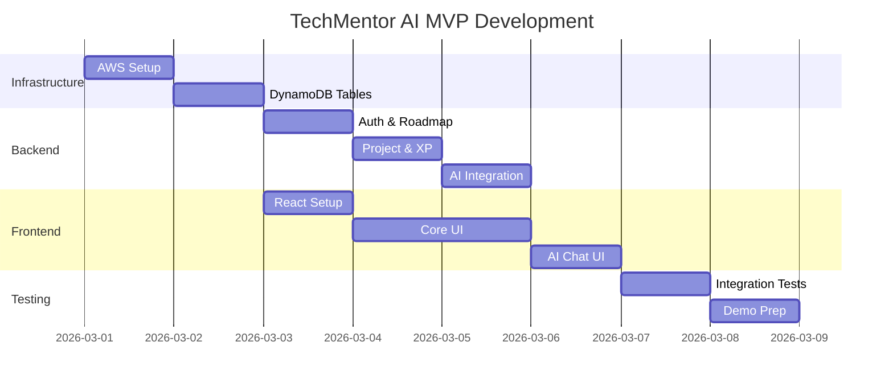

---

## 13. API Endpoint Specification

### Authentication Endpoints

```
POST /auth/register
Request: { "username": "string" }
Response: { "userId": "string", "username": "string", "token": "string" }

POST /auth/login
Request: { "username": "string" }
Response: { "userId": "string", "username": "string", "token": "string", "profile": {...} }
```

### Roadmap Endpoints

```
GET /roadmaps
Response: { "roadmaps": [{ "roadmapId": "string", "pathName": "string", ... }] }

GET /roadmaps/{roadmapId}
Response: { "roadmapId": "string", "pathName": "string", "stages": [...], "projects": [...] }

POST /questionnaire/assign
Request: { "userId": "string", "answers": [...] }
Response: { "assignedPath": "Frontend|Backend|Full Stack", "roadmapId": "string" }
```

### Project Endpoints

```
GET /projects/{projectId}
Response: { "projectId": "string", "title": "string", "tasks": [...], "techStack": [...] }

POST /tasks/complete
Request: { "userId": "string", "taskId": "string" }
Response: { "success": true, "xpEarned": 5, "totalXP": 45 }

GET /progress/{userId}
Response: { "totalXP": 45, "completedTasks": [...], "completedProjects": [...] }
```

### AI Mentor Endpoints

```
POST /mentor/ask
Request: { "userId": "string", "question": "string", "context": {...} }
Response: { "response": "string", "type": "hint|explanation|question" }

POST /mentor/feedback
Request: { "userId": "string", "code": "string", "taskId": "string" }
Response: { "feedback": "string", "suggestions": [...] }
```

### Content Generator Endpoints

```
POST /generate/readme
Request: { "userId": "string", "projectId": "string" }
Response: { "readme": "string (markdown)" }

POST /generate/linkedin
Request: { "userId": "string", "milestone": "project|xp_threshold" }
Response: { "post": "string" }
```

### Skill Booster Endpoints

```
GET /booster/quiz
Response: { "questions": [{ "questionId": "string", "question": "string", "options": [...] }] }

POST /booster/answer
Request: { "questionId": "string", "answer": "string" }
Response: { "correct": boolean, "explanation": "string" }

GET /booster/flashcards
Response: { "flashcards": [{ "flashcardId": "string", "concept": "string", ... }] }
```

### Facts Engine Endpoints

```
GET /facts
Request: { "userId": "string" }
Response: { "facts": [...], "websites": [...] }
```

### TTS Endpoints

```
POST /tts/convert
Request: { "text": "string", "voiceId": "Aditi" }
Response: { "audio": "base64_string" } or { "url": "presigned_s3_url" }
```

---

## 14. Success Metrics and KPIs

### User Engagement Metrics
- Daily Active Users (DAU)
- Weekly Active Users (WAU)
- Average session duration
- Tasks completed per user per day
- Project completion rate

### Learning Progression Metrics
- Average time to complete Beginner projects
- Average time to complete Intermediate projects
- Average time to complete Advanced projects
- Roadmap completion rate
- XP distribution across users

### AI Mentor Metrics
- AI interactions per project
- Average response time
- User satisfaction with AI responses
- Guardrail trigger rate (blocked responses)
- Most common question types

### Content Generation Metrics
- README generation requests
- LinkedIn post generation requests
- User satisfaction with generated content
- Copy-to-clipboard usage rate

### Cost Efficiency Metrics
- Total AWS costs per month
- Cost per active user
- Bedrock token usage
- DynamoDB RCU/WCU usage
- Polly character usage

### Accessibility Metrics
- Percentage of users enabling TTS
- TTS usage frequency
- Most requested TTS content types

### Technical Performance Metrics
- API response time (p50, p95, p99)
- Lambda cold start frequency
- DynamoDB query latency
- Error rate by endpoint
- Uptime percentage

---

## Conclusion

TechMentor AI demonstrates a production-ready, cost-effective AWS serverless architecture that delivers AI-powered learning at scale. The design prioritizes:

1. **Cost Efficiency**: Under $100 MVP through smart service selection and optimization
2. **Scalability**: Serverless architecture scales from 100 to 100K users without code changes
3. **User Experience**: Fast, responsive UI with context-aware AI mentorship
4. **Accessibility**: Optional TTS for inclusive learning
5. **Security**: Multi-layered security with IAM, guardrails, and encryption
6. **Future-Proof**: Clear path to RAG integration and advanced features

The platform is ready for hackathon demonstration and positioned for rapid growth in the Indian ed-tech market.
