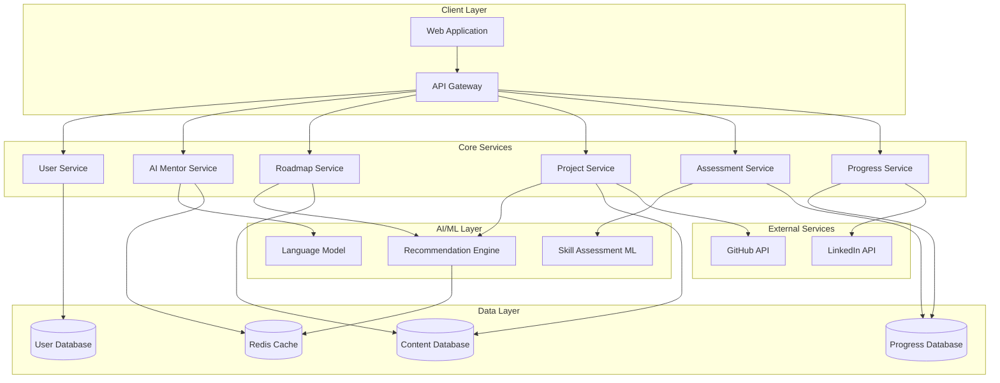

# Design Document: TechMentor AI

## Overview

TechMentor AI is an AI-powered learning mentor system that guides users through real-world projects using adaptive, hands-on learning experiences. The system employs Socratic questioning and guided reasoning to foster deep understanding rather than providing copy-paste solutions. Built on modern microservices architecture, the platform dynamically creates personalized learning roadmaps, breaks projects into manageable daily tasks, and provides comprehensive skill tracking across multiple technology domains.

The system is designed for hackathon submission with a focus on practical implementation that demonstrates core mentoring capabilities while maintaining scalability for future expansion.

## Architecture

### High-Level Architecture



### Service Architecture

The system follows a microservices architecture with clear separation of concerns:

- **API Gateway**: Routes requests, handles authentication, and rate limiting
- **User Service**: Manages user profiles, preferences, and authentication
- **AI Mentor Service**: Provides Socratic questioning and guided learning interactions
- **Roadmap Service**: Generates and manages personalized learning pathways
- **Project Service**: Manages project library, recommendations, and daily task breakdown
- **Assessment Service**: Conducts skill evaluation and competency tracking
- **Progress Service**: Tracks learning advancement and generates analytics

## Components and Interfaces

### User Management Component

**Purpose**: Handle user registration, profile management, and preference storage.

**Key Interfaces**:
```typescript
interface UserProfile {
  userId: string;
  basicInfo: {
    name: string;
    email: string;
    experienceLevel: 'beginner' | 'intermediate' | 'advanced';
  };
  interests: TechnologyDomain[];
  preferences: {
    dailyTimeCommitment: number; // minutes
    learningPace: 'slow' | 'moderate' | 'fast';
    preferredLanguages: string[];
  };
  skillLevels: Map<string, SkillRating>;
}

interface UserService {
  createProfile(userData: UserRegistration): Promise<UserProfile>;
  updatePreferences(userId: string, preferences: UserPreferences): Promise<void>;
  getProfile(userId: string): Promise<UserProfile>;
}
```

### AI Mentor Component

**Purpose**: Provide Socratic questioning and guided learning interactions without giving direct solutions.

**Key Interfaces**:
```typescript
interface MentorSession {
  sessionId: string;
  userId: string;
  projectId: string;
  conversationHistory: MentorMessage[];
  currentContext: ProjectContext;
}

interface MentorMessage {
  role: 'user' | 'mentor';
  content: string;
  timestamp: Date;
  questionType?: 'socratic' | 'clarifying' | 'guiding';
}

interface AIMentor {
  startSession(userId: string, projectId: string): Promise<MentorSession>;
  askQuestion(sessionId: string, question: string): Promise<MentorResponse>;
  provideFeedback(sessionId: string, userWork: CodeSubmission): Promise<MentorResponse>;
  generateHint(sessionId: string, difficulty: string): Promise<string>;
}
```

### Roadmap Generation Component

**Purpose**: Create comprehensive, progressive learning pathways for technology domains.

**Key Interfaces**:
```typescript
interface LearningRoadmap {
  roadmapId: string;
  domain: TechnologyDomain;
  skillLevel: SkillLevel;
  modules: LearningModule[];
  estimatedDuration: number; // weeks
  prerequisites: string[];
}

interface LearningModule {
  moduleId: string;
  title: string;
  description: string;
  concepts: string[];
  projects: string[];
  estimatedHours: number;
  prerequisites: string[];
}

interface RoadmapService {
  generateRoadmap(userId: string, domain: TechnologyDomain): Promise<LearningRoadmap>;
  updateRoadmap(roadmapId: string, progress: UserProgress): Promise<LearningRoadmap>;
  getRoadmapProgress(userId: string, roadmapId: string): Promise<RoadmapProgress>;
}
```

### Project Management Component

**Purpose**: Manage real-world project library and break projects into daily tasks.

**Key Interfaces**:
```typescript
interface RealWorldProject {
  projectId: string;
  title: string;
  description: string;
  domain: TechnologyDomain;
  difficulty: SkillLevel;
  industryContext: string;
  technologies: string[];
  estimatedHours: number;
  learningObjectives: string[];
}

interface DailyTask {
  taskId: string;
  projectId: string;
  title: string;
  description: string;
  estimatedMinutes: number;
  prerequisites: string[];
  learningGoals: string[];
  resources: LearningResource[];
}

interface ProjectService {
  getRecommendations(userId: string): Promise<RealWorldProject[]>;
  breakdownProject(projectId: string, userPreferences: UserPreferences): Promise<DailyTask[]>;
  getProjectDetails(projectId: string): Promise<RealWorldProject>;
  trackTaskCompletion(userId: string, taskId: string): Promise<void>;
}
```

### Skill Assessment Component

**Purpose**: Evaluate user capabilities through interactive assessments and project work analysis.

**Key Interfaces**:
```typescript
interface SkillAssessment {
  assessmentId: string;
  userId: string;
  domain: TechnologyDomain;
  questions: AssessmentQuestion[];
  codingChallenges: CodingChallenge[];
  results: SkillRating[];
}

interface AssessmentQuestion {
  questionId: string;
  type: 'multiple-choice' | 'coding' | 'scenario';
  content: string;
  options?: string[];
  expectedAnswer: string;
  skillsEvaluated: string[];
}

interface AssessmentService {
  conductInitialAssessment(userId: string): Promise<SkillAssessment>;
  evaluateTaskCompletion(userId: string, taskId: string, submission: TaskSubmission): Promise<SkillUpdate>;
  updateSkillRatings(userId: string, skillUpdates: SkillUpdate[]): Promise<void>;
}
```

### Progress Tracking Component

**Purpose**: Monitor learning advancement and generate detailed analytics.

**Key Interfaces**:
```typescript
interface ProgressMetrics {
  userId: string;
  totalHoursSpent: number;
  projectsCompleted: number;
  tasksCompleted: number;
  skillImprovements: SkillImprovement[];
  learningVelocity: number;
  consistencyScore: number;
}

interface LearningAnalytics {
  strengthAreas: string[];
  improvementAreas: string[];
  recommendedActions: string[];
  progressTrends: ProgressTrend[];
  comparisonMetrics: BenchmarkComparison;
}

interface ProgressService {
  trackDailyActivity(userId: string, activity: LearningActivity): Promise<void>;
  generateAnalytics(userId: string): Promise<LearningAnalytics>;
  getProgressSummary(userId: string): Promise<ProgressMetrics>;
}
```

## Data Models

### Core Data Structures

**User Profile Model**:
```typescript
interface UserProfile {
  userId: string;
  email: string;
  name: string;
  createdAt: Date;
  lastActive: Date;
  experienceLevel: SkillLevel;
  interests: TechnologyDomain[];
  preferences: UserPreferences;
  skillRatings: Map<string, SkillRating>;
  activeRoadmaps: string[];
  completedProjects: string[];
}
```

**Learning Roadmap Model**:
```typescript
interface LearningRoadmap {
  roadmapId: string;
  userId: string;
  domain: TechnologyDomain;
  createdAt: Date;
  lastUpdated: Date;
  currentModule: string;
  modules: LearningModule[];
  overallProgress: number; // 0-100
  estimatedCompletion: Date;
}
```

**Project Model**:
```typescript
interface RealWorldProject {
  projectId: string;
  title: string;
  description: string;
  domain: TechnologyDomain;
  difficulty: SkillLevel;
  technologies: string[];
  industryContext: string;
  learningObjectives: string[];
  dailyTasks: DailyTask[];
  estimatedHours: number;
  prerequisites: string[];
  createdAt: Date;
  updatedAt: Date;
}
```

**Progress Tracking Model**:
```typescript
interface UserProgress {
  userId: string;
  date: Date;
  activitiesCompleted: LearningActivity[];
  timeSpent: number; // minutes
  skillsImproved: SkillImprovement[];
  projectsAdvanced: ProjectProgress[];
  consistencyStreak: number;
}
```

### Database Schema Design

**Users Collection**:
- Primary key: userId
- Indexes: email, createdAt, lastActive
- Relationships: One-to-many with Progress, Roadmaps

**Projects Collection**:
- Primary key: projectId
- Indexes: domain, difficulty, technologies
- Full-text search: title, description, learningObjectives

**Progress Collection**:
- Primary key: (userId, date)
- Indexes: userId, date, skillsImproved
- Time-series optimized for analytics queries

**Roadmaps Collection**:
- Primary key: roadmapId
- Indexes: userId, domain, currentModule
- Embedded documents: modules, progress tracking

## Correctness Properties

*A property is a characteristic or behavior that should hold true across all valid executions of a system—essentially, a formal statement about what the system should do. Properties serve as the bridge between human-readable specifications and machine-verifiable correctness guarantees.*

Based on the requirements analysis, the following correctness properties ensure the system behaves as specified across all valid inputs and scenarios:

### Property 1: User Registration Data Collection
*For any* user registration attempt with valid input data, the system should collect and store all required profile information including experience level, learning interests, and technology preferences, making this data retrievable for future personalization.
**Validates: Requirements 1.1, 1.5**

### Property 2: Assessment-Triggered Skill Classification
*For any* completed skill assessment, the system should produce accurate skill level classifications across all evaluated technology domains and trigger personalized roadmap generation based on detected skills and stated interests.
**Validates: Requirements 1.2, 1.3, 1.4**

### Property 3: Comprehensive Roadmap Generation
*For any* selected technology domain or user interest change, the system should generate complete progressive roadmaps containing foundational concepts, intermediate projects, and advanced applications with proper prerequisite relationships and time estimates.
**Validates: Requirements 2.1, 2.2, 2.4, 2.5**

### Property 4: Adaptive Project Recommendations
*For any* user requesting project recommendations, the system should analyze current skill level, completed projects, and roadmap position to prioritize projects that align with active learning paths and adapt recommendations based on project completion and progress patterns.
**Validates: Requirements 3.1, 3.2, 3.3, 3.4, 3.5**

### Property 5: Socratic Mentoring Constraint
*For any* user interaction with the AI mentor, the system should never provide complete code solutions or direct answers, instead offering explanations, Socratic questions, hints, and learning resources that guide users toward their own discoveries.
**Validates: Requirements 4.1, 4.2, 4.3, 4.4, 4.5**

### Property 6: Personalized Daily Task Breakdown
*For any* project initiation, the system should break the project into specific, achievable daily tasks that consider the user's available time and learning pace preferences, ensuring each task can be completed within reasonable time frames.
**Validates: Requirements 5.1, 5.2, 5.3**

### Property 7: Adaptive Task Management
*For any* daily task completion or missed task, the system should record the outcome, adjust future task sizing accordingly, and provide appropriate reminders or adjustment options to maintain learning consistency.
**Validates: Requirements 5.4, 5.5**

### Property 8: Comprehensive Progress Tracking
*For any* completed learning activity (task or project), the system should assess demonstrated skills, update competency ratings, maintain detailed history of all learning activities, and display skill progression across all active roadmaps when users view their progress.
**Validates: Requirements 6.1, 6.2, 6.3, 6.4, 6.5**

### Property 9: Career-Contextual Project Information
*For any* project in the system library, the project should include context about how it relates to specific career paths and professional roles, providing learners with clear connections between projects and career development.
**Validates: Requirements 7.5**

### Property 10: Comprehensive Documentation Guidance
*For any* completed project, the system should provide README structure templates, best practices guidance, appropriate content suggestions for all documentation sections, and professional standards information without automatically publishing to user repositories.
**Validates: Requirements 8.1, 8.2, 8.3, 8.5**

### Property 11: Professional Showcase Guidance
*For any* significant learning milestone, the system should suggest draft LinkedIn content that focuses on learning journey and skill development, provide professional language guidance, and include various announcement templates without automatically posting to social media accounts.
**Validates: Requirements 9.1, 9.2, 9.3, 9.5**

### Property 12: No Automatic Publishing Constraint
*For any* system operation involving external platforms (GitHub, LinkedIn), the system should never automatically publish, commit, or post content to user accounts, maintaining user control over all external communications.
**Validates: Requirements 8.4, 9.4**

### Property 13: Dynamic Roadmap Evolution
*For any* significant skill advancement, new interest development, or learning pattern change, the system should adapt roadmap progression, generate additional roadmaps with skill synergy identification, and adjust pacing while maintaining coherent progression and user autonomy.
**Validates: Requirements 10.1, 10.2, 10.3, 10.4**

## Error Handling

### Input Validation Strategy

**User Input Validation**:
- All user registration data must be validated against defined schemas
- Skill assessment responses must be validated for completeness and format
- Project submissions must be checked for required components
- Invalid inputs should trigger clear, actionable error messages

**AI Mentor Response Validation**:
- Mentor responses must be validated to ensure they don't contain complete solutions
- Response content should be analyzed for appropriate Socratic questioning patterns
- Fallback responses should be available when AI generation fails

**Data Consistency Checks**:
- User profiles must maintain consistency between skill levels and roadmap assignments
- Progress tracking data must be validated for logical consistency (e.g., completion dates)
- Roadmap prerequisites must form valid dependency graphs without cycles

### Failure Recovery Mechanisms

**Service Degradation Handling**:
- When AI mentor service is unavailable, provide cached guidance and learning resources
- If recommendation engine fails, fall back to rule-based project suggestions
- Progress tracking failures should not block user learning activities

**Data Recovery Procedures**:
- Implement automatic backup and recovery for user progress data
- Maintain audit logs for all skill assessment and roadmap changes
- Provide manual recovery options for corrupted user profiles

**External Service Failures**:
- GitHub API failures should not prevent documentation guidance generation
- LinkedIn API issues should not block milestone celebration features
- Graceful degradation when external content sources are unavailable

## Testing Strategy

### Dual Testing Approach

The system requires both unit testing and property-based testing to ensure comprehensive coverage:

**Unit Tests** focus on:
- Specific examples of user registration flows and edge cases
- Integration points between microservices
- Error conditions and boundary cases for skill assessment
- Specific mentor response patterns and content validation
- Database operations and data consistency checks

**Property-Based Tests** focus on:
- Universal properties that hold across all user inputs and scenarios
- Comprehensive input coverage through randomization of user profiles, projects, and interactions
- Validation of system constraints like "never provide complete solutions"
- Adaptive behavior verification across different user learning patterns

### Property-Based Testing Configuration

The system will use **Hypothesis** (Python) for property-based testing with the following configuration:
- Minimum **100 iterations** per property test to ensure thorough coverage
- Each property test must reference its corresponding design document property
- Tag format: **Feature: tech-mentor-ai, Property {number}: {property_text}**

**Example Property Test Structure**:
```python
@given(user_profile=user_profiles(), project_request=project_requests())
@settings(max_examples=100)
def test_adaptive_project_recommendations(user_profile, project_request):
    """Feature: tech-mentor-ai, Property 4: Adaptive Project Recommendations"""
    recommendations = recommendation_service.get_recommendations(
        user_profile, project_request
    )
    
    # Verify recommendations align with active roadmaps
    assert all(
        rec.domain in user_profile.active_roadmap_domains 
        for rec in recommendations
    )
    
    # Verify skill level appropriateness
    assert all(
        rec.difficulty <= user_profile.skill_level_for_domain(rec.domain)
        for rec in recommendations
    )
```

### Integration Testing Strategy

**End-to-End Learning Flows**:
- Complete user journey from registration through project completion
- Multi-roadmap scenarios with cross-domain skill development
- Long-term progress tracking and roadmap evolution testing

**AI Mentor Interaction Testing**:
- Socratic questioning pattern validation across different user skill levels
- Response appropriateness testing for various help request types
- Constraint validation ensuring no complete solutions are provided

**Performance and Scalability Testing**:
- Load testing for concurrent user sessions and mentor interactions
- Database performance testing for progress tracking and analytics queries
- Caching effectiveness testing for recommendation engine responses

Each correctness property must be implemented as a single property-based test that validates the universal behavior across all valid inputs, ensuring the system maintains its educational integrity and adaptive learning capabilities.